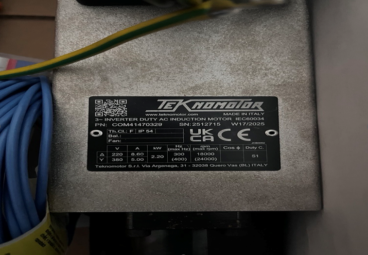
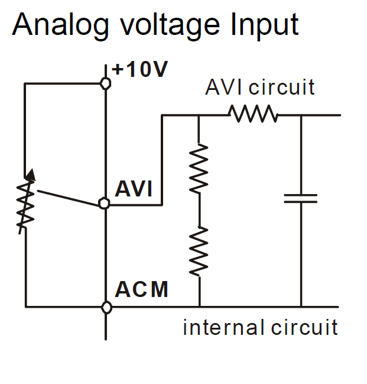
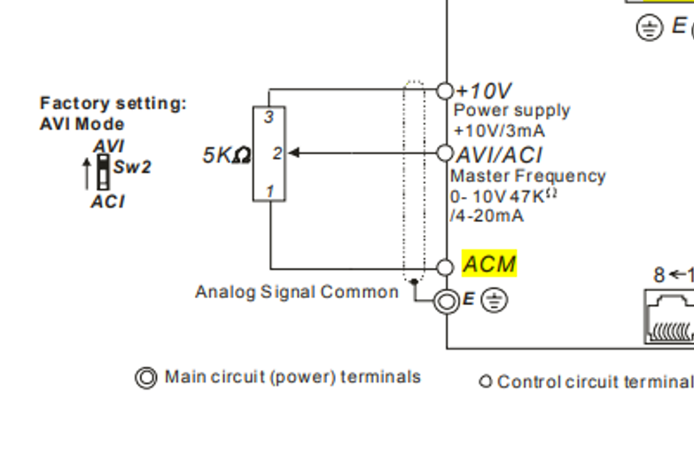
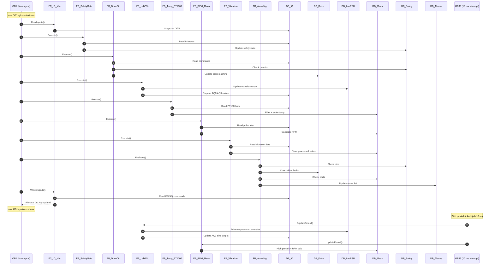
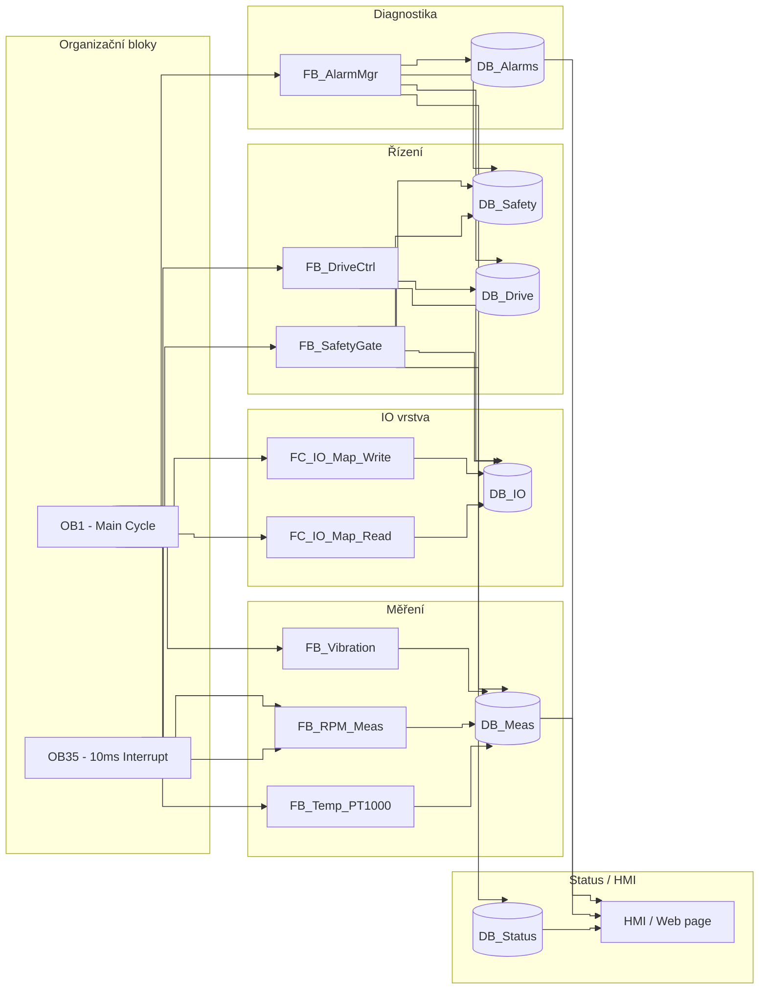

# spindle-vfd-control

Project deals with control of vfd spindle. Aim of the work is to adopt practical skills to work with spindle and sensors.

---

## Ovládání měniče

### Nastavení parametrů
- Zapojit měnič do sítě.
- Klávesou **Enter** se dostaneme do zadávání P parametrů. Opakovaným mačkáním lze nastavit skupinu `P01.xx` nebo konkrétní parametr `P01.0x`. Šipkami nahoru/dolů se nastaví hodnota a Enter potvrdí.
- Měnič je nastaven pro řízení motoru do 18 000 otáček. Parametry jsou uloženy v permanentní paměti.

---

### Parametry P01 – Provozní parametry

| Parametr | Hodnota | Popis |
|----------|---------|-------|
| P01-00 | 300 Hz | Fmax – dle štítku motoru (18k rpm). Pro 24k rpm → 400 Hz |
| P01-01 | 300 Hz | FBase – od 0 Hz do FBase roste krouťák lineárně. Nad FBase krouťák klesá |
| P01-02 | 220 V  | Vmax – dle štítku motoru. Používá se pro výpočet U/f poměru |
| P07-00 | 8,6 A  | Motor rated current – dle štítku motoru |

---

### Parametry P02 – Nastavení ovládání

| Parametr | Hodnota | Popis |
|----------|---------|-------|
| P02.00 | 1 | Source of First Master Frequency Command – zdroj frekvence → analog vstup AVI (P04.07 = 0 → AVI = 0–10 V) |
| P02.01 | 1 | Source of First Operation Command – External Terminals, Keypad STOP/RESET enabled |

---

### Parametry P04 – Multifunkční vstupy MIx

| Parametr | Hodnota | Vstup | Funkce |
|----------|---------|-------|--------|
| P4-00 | 1 | MI1 | Run Forward – Start/Stop vřetena |
| P4-01 | 3 | MI2 | Emergency Stop – okamžité vypnutí |
| P4-02 | 6 | MI3 | Fault Reset – reset po chybě |
| P4-03 | 8 | MI4 | Multi-speed 1 – druhá pevná rychlost |
| P4-04 | 7 | MI5 | External Fault – aktivuje externí chybový stav |
| P4-05 | 0 | MI6 | Not used – volný vstup |
| P4-07 | 0 | AVI | AVI input select – 0 = 0–10 V, 1 = 4–20 mA |

---

### PLC tagy pro ovládání MI vstupů

V PLC jsou vytvořeny tagy, které přes DQ aktivují signály MI vstupů. Na tagy šahá web/HMI:

- **Run Forward** – aktivuje ovládání otáček motoru přes AVI signál (alias AO_Ch2)
- **Emergency Stop**
- **Fault Reset**
- **Multi-speed 1**
- **External Fault**

---

### Zapojení fyzického propojení (PLC DQ → MI)

#### Digitální signály
- PLC DQ (digitální výstup 24 V) → MIx (např. MI1) na měniči.
- PLC 0 V (GND) → DCM (digital common) měniče – společná reference je nutná!
- Na měniči lze použít interní +24 V jako zdroj, nebo nech PLC dodávat 24 V.
- Pokud jsou PLC výstupy PNP (sourcing): PLC DO → MI, GND → DCM.
- Ujisti se, zda je měnič nastaven pro NPN/PNP (COM polarity) – někdy parametrem nebo propojkou.

#### Analogové řídící signály
- Analogový výstup se zapojí na vstupy: **AVI** (PLC AO Ux+), **ACM** (PLC AO Ux–).
- Přepínače **SW1** (PNP/NPN), **SW2** (AVI/ACI) jsou přepnuty směrem **nahoru**.

<table>
  <tr>
    <td align="center"> <em>Zapojení AVI</em></td>
    <td align="center"> <em>Přepínače SW1/SW2</em></td>
  </tr>
</table>

#### Zapojení motoru
- Zapojení do **trojúhelníku**.

---

## TIA Project

Rozpracovaný projekt na laptopu:
`GenerateAQSignal_TIAP_9618_21.00.00.00_01.00.0001`

### Kde pokračovat
- **ProjectKarel** – nástroje pro kreslení zapojení

---

## Appendix 1 – Sequence diagram (Mermaid)

---

## Appendix 2 – Blok diagram (Mermaid)
<!-- filepath: README.md -->
<!-- ...existing code... -->

