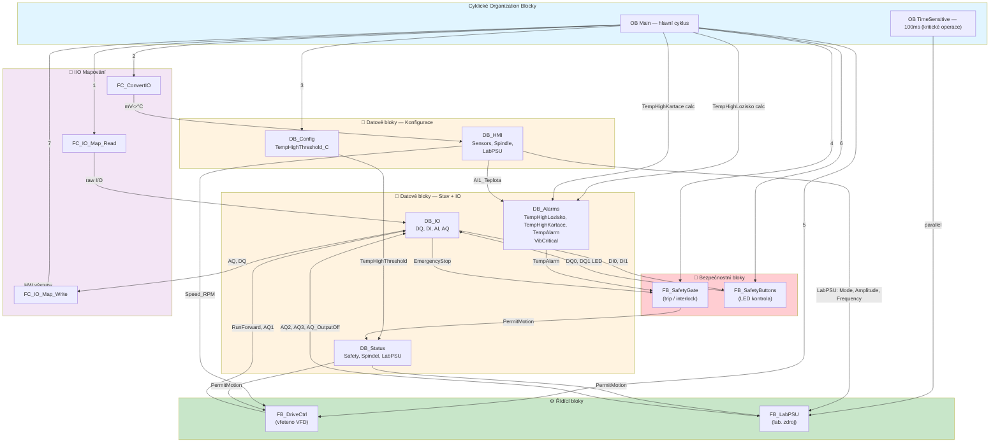
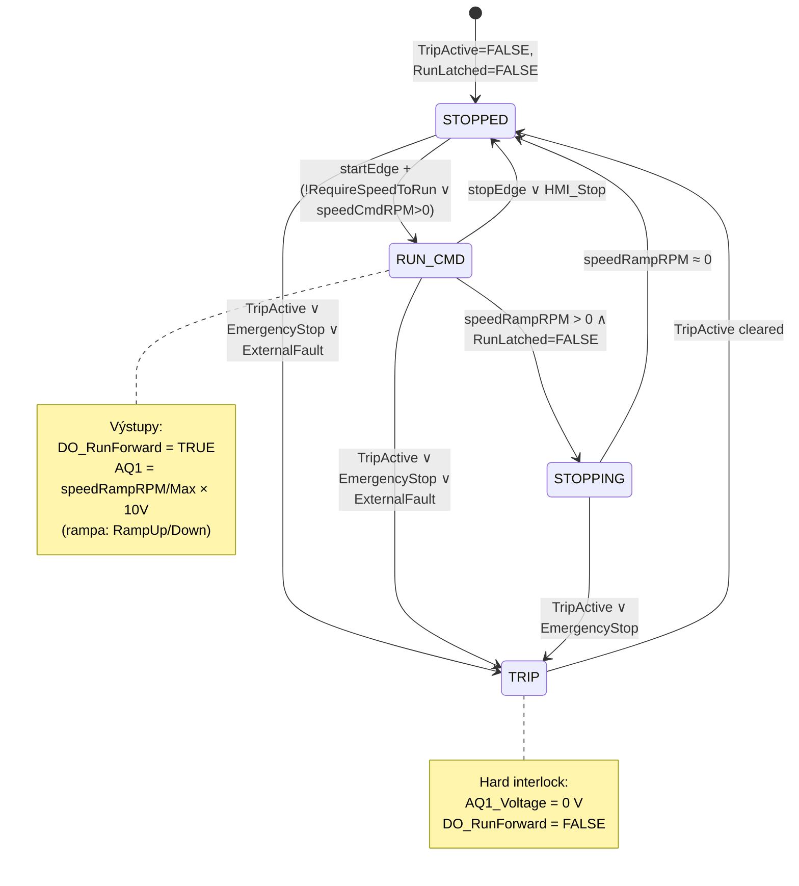
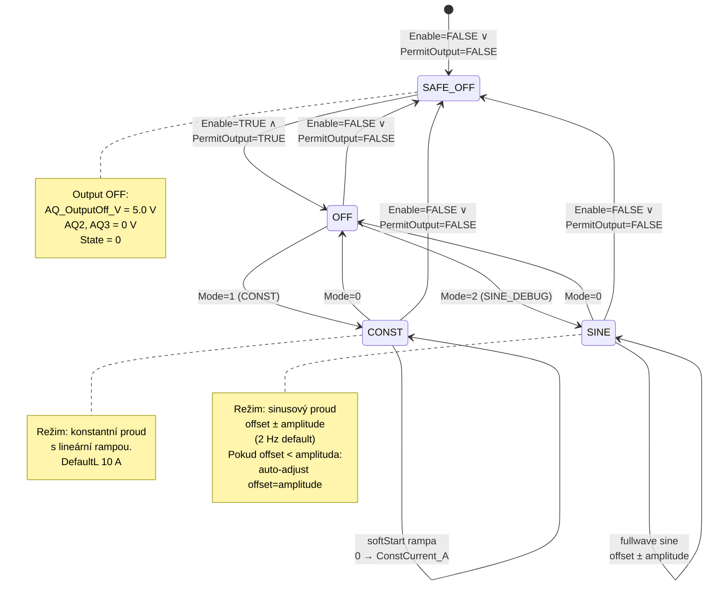

# PLC Program — Architektura a dokumentace

Tato stránka dokumentuje architekturu, stavové automaty a klíčové proměnné PLC programu v [plc/program.scl](../plc/program.scl).

---

## Architektura — Volání bloků a datové toky



---

## Stavové automaty

### FB_DriveCtrl — Stavy vřetena



### FB_LabPSU — Stavy laboratorního zdroje



---

## Bloky a jejich účel

| Blok | Typ | Účel | Instance DB | Bezpečnostní? |
|------|-----|------|-------------|:-------------:|
| **OB Main** | OB | Hlavní cyklus — orchestrace všech FB, I/O mapping | — | ✅ |
| **OB TimeSensitive** | OB | Časově kritické: LabPSU (každý cyklus s přesným timingem) | — | ✅ |
| **FB_SafetyGate** | FB | Centrální trip — E-Stop, safety relé, alarmy | `Safety_1` | ✅ CRITICAL |
| **FB_DriveCtrl** | FB | Řízení vřetena — start/stop, ramp-up/down, AQ1 napětí | `Spindel` | ✅ |
| **FB_LabPSU** | FB | Řízení lab. zdroje — CONST / SINE režim, AQ2/AQ3 | `LabPSU`, `FB_LabPSU_DB` | ✅ |
| **FB_SafetyButtons** | FB | LED indikace E-Stop tlačítka | `FB_SafetyButtons_DB` | ✅ |
| **FC_IO_Map_Read** | FC | Čtení fyzických DI/AI → `DB_IO` | — | ✅ |
| **FC_IO_Map_Write** | FC | Zápis `DB_IO` (AQ, DQ) → fyzické výstupy | — | ✅ |
| **FC_ConvertIO** | FC | Konverze senzorů: Ω → °C, raw → RPM | — | ⚠️ |
| **FC_Scale** | FC | Lineární škálování: in_range → out_range | — | — |

---

## Datové bloky — Konfigurace

### DB_Config

| Proměnná | Typ | Defaultní | Účel |
|----------|-----|-----------|------|
| `TempHighThreshold_C` | Real | 65.0 | Práh teploty pro trip |
| `VibCriticalThreshold` | Real | 0.0 | Práh vibrací (placeholder) |
| `DAC_MaxDacRange` | Int | 27648 | Max rozsah DAC převodníku (0–27648) |

### DB_HMI

| Struktura | Pole | Typ | Účel |
|-----------|------|-----|------|
| **Sensors** | `AI1_Teplota_Lozisko_C` | Real | Teplota ložiska (°C) — z RTD AI1 |
| | `AI2_Teplota_Kartace_C` | Real | Teplota kartáčů (°C) — z RTD AI2 |
| | `TM_Rotation_A_Channel` | Real | Otáčky (RPM) — z HSC čítače |
| **System** | `Enable` | Bool | Globální enable systému |
| **Spindle** | `Start` | Bool | Start tlačítko |
| | `Stop` | Bool | Stop tlačítko |
| | `ResetFault` | Bool | Reset fault tlačítko |
| | `Speed_RPM` | Real | Setpoint otáček vřetena |
| | `Enable` | Bool | Enable vřetena |
| **LabPSU** | `Enable` | Bool | Enable zdroje |
| | `Cycle_s` | Real | Časová základna výpočtu (s), **MUSÍ = perioda OB** (OB30=0.1s) |
| | `Mode` | USInt | 0=OFF, 1=CONST, 2=SINE_DEBUG |
| | `BaseVoltage_V` | Real | Napětí na výstupu (0.8–16 V) |
| | `DebugAmplitude_A` | Real | Amplituda sinusu pro debug režim (A) |
| | `DebugPeriod_min` | Real | Perioda sinusu (min, default 10.0) |
| | `CurrentOffset_A` | Real | DC offset proudu (A) |
| | `ConstCurrent_A` | Real | Cílový proud v CONST režimu (A) |

---

## Datové bloky — Stav a I/O

### DB_Status

| Struktura | Pole | Typ | Účel |
|-----------|------|-----|------|
| **Spindel** | `RunLatched` | Bool | Vřeteno běží (interní latch) |
| | `TripActive` | Bool | Interlock aktivní |
| | `State` | USInt | 0=STOPPED, 1=RUN_CMD, 2=STOPPING, 3=TRIP |
| | `StatusText` | String[40] | Diagnostika |
| **Safety** | `SafetyOk` | Bool | Hardware safety OK (relé + !E-Stop) |
| | `PermitMotion` | Bool | Povolení pohybu (všechny bezpečnostní podmínky OK) |
| | `TripActive` | Bool | Trip aktivní (centrální) |
| | `TripCode` | USInt | 1=E-Stop, 2=Relé, 3=ExtFault, 4=Temp, 5=Vib, 6=Disabled |
| | `StatusText` | String[40] | Diagnostika |
| **LabPSU** | `VoltageSet_V` | Real | Aktuální nastavené napětí (V) |
| | `CurrentSet_A` | Real | Aktuální nastavený proud (A) |
| | `State` | USInt | 0=OFF, 1=CONST, 2=SINE_DEBUG |
| | `StatusText` | String[40] | Diagnostika (včetně "AUTO OFFSET" varovky) |

### DB_IO — Mapování fyzického I/O

#### DI — Digitální vstupy

| Pole | Zdroj | Účel |
|------|--------|-------|
| `SafetyRelayAuxOk` | `DI0_SafetyRelay_Aux` | Aux výstup safety relé (1 = OK) |
| `EmergencyStop` | `!DI1_SafetyRelay_State` | E-Stop řetěz (1 = aktivní) |
| `ExternalFault` | analog | Externí chyba |
| `HSC_Counter` | HW čítač | Otáčky vřetena (raw counts) |

#### AI — Analogové vstupy

| Pole | Zdroj | Škálování |
|------|--------|-----------|
| `AI1_TeplotaLoziska_Ohm` | `AI1_RTD` | Raw (Ohmy) → °C (mapování: /10) |
| `AI2_TeplotaKartace_Ohm` | `AI2_RTD` | Raw (Ohmy) → °C (mapování: /10) |

#### DQ — Digitální výstupy

| Pole | Cíl | Logika |
|------|-----|--------|
| `RunForwardCmd` | `DQ0_MI1_Run_Forward` | Příkaz start vřetena (VFD) |
| `ResetButtonLed` | `DQ1_Reset_Button_Blue_LED` | Modré LED reset tlačítka |
| `EmergencyStopButtonLed` | `DQ2_Stop_Button_Red_Led` | Červené LED E-Stop tlačítka |
| `FaultResetCmd` | — | Příkaz reset fault (VFD) — 300ms puls |
| `MultiSpeed1` | — | Multi-speed bit (nepoužívá se) |
| `ExternalFault` | — | External fault propagace (nepoužívá se) |
| ~~`LabPsuOutputOff`~~ | ~~REMOVED~~ | Nahrazeno AQ kanálem |

#### AQ — Analogové výstupy (0–5 V, mapuje se na DAC 0–27648)

| Pole | Cíl | Rozsah | Účel |
|------|-----|--------|------|
| `SpeedVoltage` | `AQ_Ch1` | 0–10 V | Otáčky vřetena: `speedRampRPM / 18000 × 10 V` |
| `AQ2_VoltageCtrl_V` | `AQ_Ch3` | 0–5 V (→ DAC) | Napětí lab. zdroje (`VoltageSet_V / 16 × 5 V`) |
| `AQ1_CurrentCtrl_V` | `AQ_Ch2` | 0–5 V (→ DAC) | Proud lab. zdroje (`CurrentSet_A / 60 × 5 V`) |
| `AQ3_OutputOff` | `AQ_Ch4` | 0–5 V (→ DAC) | **Výstup lab. zdroje: 5 V = OFF, 0 V = ON** |

---

## Klíčové proměnné pro údržbu

### FB_DriveCtrl — Vstupní parametry pro nastavení

```
HMI_Start              bool    — Start tlačítko
HMI_Stop               bool    — Stop tlačítko
HMI_ResetFault         bool    — Reset fault
HMI_Speed_RPM          real    — Setpoint (0–18000)
PermitMotion           bool    — Z FB_SafetyGate
EmergencyStop          bool    — E-Stop řetěz
ExternalFaultIn        bool    — Externí chyba

SpeedMax_RPM           real    18000.0   — Max otáčky
AO_MaxVolt             real    10.0      — Max napětí AQ1
RampUp_RPM_per_s       real    6000.0    — Zrychlení
RampDown_RPM_per_s     real    9000.0    — Zpomalení
ResetPulse             time    300ms     — Délka reset pulsu
RequireSpeedToRun      bool    false     — Vyžadovat Speed > 0 pro start
```

### FB_LabPSU — Vstupní parametry pro nastavení

```
Enable                 bool    — Enable z HMI (Spindle.Start)
PermitOutput           bool    — Z FB_SafetyGate.PermitMotion
Mode                   uint    0/1/2     — 0=OFF, 1=CONST, 2=SINE
BaseVoltage_V          real    1.0–16.0  — Napětí výstupu
CurrentOffset_A        real    0–60      — DC offset (SINE režim)
DebugAmplitude_A       real    0–60      — Amplituda sinusu
DebugPeriod_min        real    1–60      — Perioda sinusu v minutách
ConstCurrent_A         real    0–60      — Cílový proud (CONST režim)
RampUp_A_per_s         real    50.0      — Zrychlení CONST
RampDown_A_per_s       real    80.0      — Zpomalení CONST
PSU_MinVoltage_V       real    0.8       — Min. napětí (stabilita)
PSU_MaxVoltage_V       real    16.0      — Max. napětí (zdroj limit)
PSU_MaxCurrent_A       real    38.0      — Max proud ZADÁNÍ (limit zákazníka, clamping)
RemoteMaxCtrl_V        real    5.0       — Max. kontrolní napětí
```

**Poznámka k proudovému limitu:**
- `PSU_MaxCurrent_A = 38.0` omezuje pouze ZADÁVÁNÍ hodnoty uživatelem
- Kalibrovaný přepočet `U = (I/15.92) + 0.383` platí pro celý rozsah 0-60A
- Hardwarový limit zdroje BK1900B: 60A (fyzická kapacita)

```

### FB_SafetyGate — Bezpečnostní logika

```
Enable                 bool    — Globální enable (TRUE = systém povolený)
EmergencyStop          bool    — E-Stop aktivní (1 = aktivní)
SafetyRelayAuxOk       bool    — Safety relé OK (1 = OK)
ExternalFault          bool    — Externí chyba
TempAlarm              bool    — Alarm teploty (z DB_Alarms.TempAlarm = TempHighLozisko OR TempHighKartace)
VibAlarm               bool    — Alarm vibrací (z DB_Alarms.VibCritical)

Výstupy:
SafetyOk               bool    — Hardware safety OK
PermitMotion           bool    — Povolení pohybu (negace TripActive)
TripActive             bool    — Trip (interlock + alarmy + disabled)
TripCode               uint    1–6 — Kód přípravy
StatusText             str40   — Diagnostika
```

---

## Bezpečnostní logika

### Trip podmínka (centrální)

```
TripActive = (NOT SafetyOk)
          OR ExternalFault
          OR TempAlarm
          OR VibAlarm
          OR (NOT Enable)
```

Kde:
- `SafetyOk = SafetyRelayAuxOk AND NOT EmergencyStop`
- `TempAlarm = DB_Alarms.TempAlarm` (kombinovaný alarm: TempHighLozisko OR TempHighKartace)
  - Vypočítáno v OB Main z DB_Config.TempHighThreshold_C (65°C)
  - `TempHighLozisko`: AI1_RTD (teplota ložiska) > 65°C
  - `TempHighKartace`: AI2_RTD (teplota kartáčů) > 65°C
- `VibAlarm = DB_Alarms.VibCritical` (zatím placeholder)

### Bezpečné stavy

| Signál | Bezpečný stav | Účel |
|--------|---------------|------|
| `DO_RunForward` | FALSE | Vřeteno OFF |
| `AQ1_Voltage` | 0.0 V | Žádná otáčky |
| `AQ_OutputOff_V` | 5.0 V | Lab. zdroj OFF |
| `AQ2_VoltageCtrl_V` | 0.0 V | Nula napětí |
| `AQ3_CurrentCtrl_V` | 0.0 V | Nula proudu |

---

## Poznámky pro údržbu

1. **Teplotní threshold**: Centralizován v `DB_Config.TempHighThreshold_C` (default 65 °C).
   - Změna thresholdu: edituj DB_Config přímo v TIA nebo změň value v `BEGIN`.

2. **SINE režim**: Generuje plný sinusový průběh s DC offsetem.
   - **Průběh začíná od 0A**: Při vstupu do SINE režimu se fáze resetuje na `-π/2` rad
   - Důvod: `SIN(-π/2) = -1` → `I = offset + amplitude × (-1) = 0A` (požadavek zákazníka)
   - Pokud `offset < amplitude` → PLC auto-korekta na `offset = amplitude`.
   - Výstup je vždy clampován na 0–38 A (limit zákazníka).
   - StatusText zobrazí "AUTO OFFSET" pokud byla korekta použita.

3. **OutputOff signál**: Nyní **analogový** (AQ_Ch4, 0–5 V):
   - 5.0 V = PSU vypnutý (safe state)
   - 0.0 V = PSU zapnutý
   - Pozor: HW pin musí být správně zapojen na zdroj!

4. **Safety auto-restart fix**: Run latch nyní reaguje **jen na náběžnou hranu** Start.
   - Pokud je Start držen a safety trip se uvolní → motor se NEUJEDOU bez nového stisknutí.

5. **Odstraněný kód**: `DQ3_LabPsu_Enable` (digitální) byl nahrazen `AQ_Ch4` (analog).
   - Pokud máš HW zapojení na starý DQ3 pin, bude potřeba změnit wiring na AQ_Ch4.

---

## Verze a historie

- **Verze 1.0** — 2026-05-07
  - Oprava safety auto-restart (edge detection)
  - Přechod OutputOff z digitálu na analog
  - Centralizace teplotního thresholdu do DB_Config
  - Opravy typů v DB_HMI (Bool → Real)
  - SINE režim: plný průběh s offsetem + auto-korekta
  - Bezpečné stavy v SAFE_OFF režimu

---

Zkontroluj si kód a dokumentaci. Pokud jsou nějaké nepřesnosti nebo nevyhovuje ti něco, klidně řekni — opravíme to.
