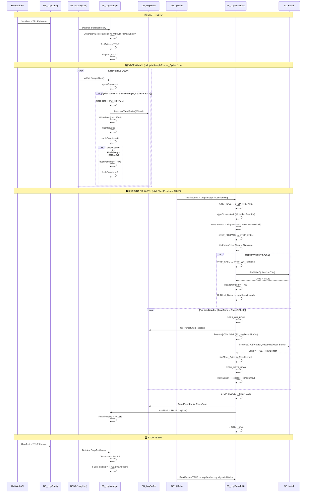
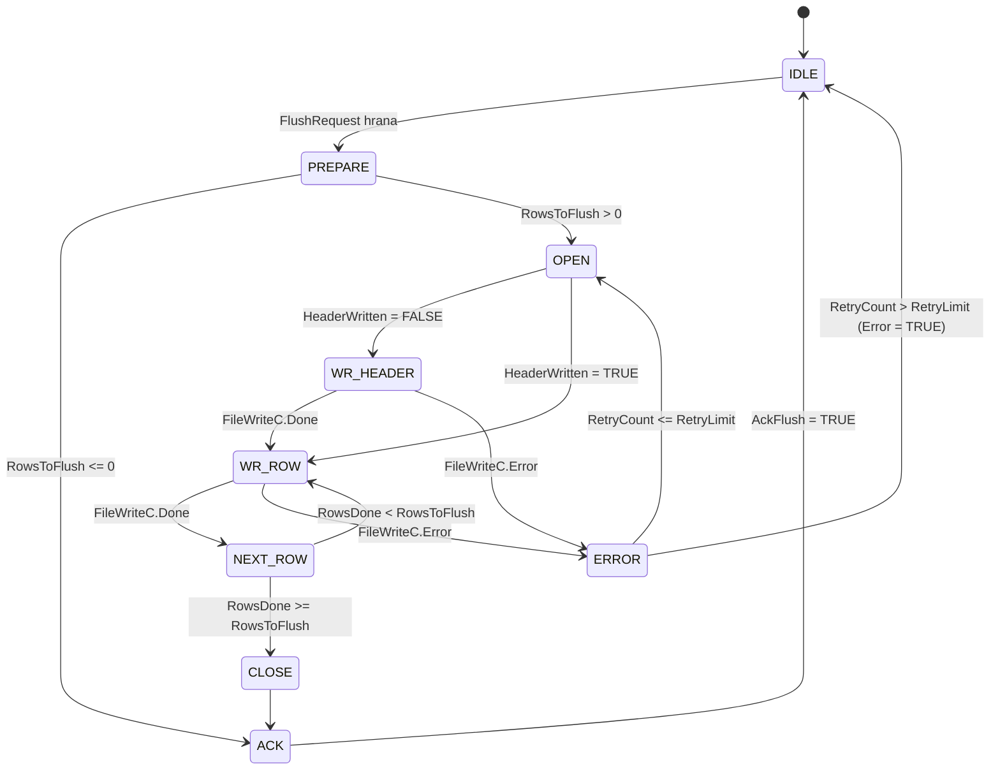

# Diagnostika CSV loggingu na SD kartu

## Diagram toku dat (mermaid)



---

## Stavový automat FB_LogFlushToSd



---

## Klíčové proměnné pro diagnostiku

### DB_LogConfig (konfigurace)
| Proměnná | Typ | Význam | Kontrola |
|----------|-----|--------|----------|
| `Enable` | Bool | Povolit logování | ✅ Musí být TRUE |
| `StartTest` | Bool | Trigger start testu | ⚡ Hrana 0→1 |
| `StopTest` | Bool | Trigger stop testu | ⚡ Hrana 0→1 |
| `TestDuration_s` | DInt | Max. délka testu (s) | ⏱️ Např. 86400 (24h) |
| `FlushEveryN` | Int | Počet vzorků mezi flushy | 📊 Např. 100 |

### DB_LogRuntime (stav běhu)
| Proměnná | Typ | Význam | Co sledovat |
|----------|-----|--------|-------------|
| `TestActive` | Bool | Test právě běží | ✅ TRUE během testu |
| `FileName` | String[32] | Název CSV souboru | 📄 Např. "20260729-143025.csv" |
| `HeaderWritten` | Bool | Hlavička již zapsána | ✅ TRUE po prvním flushu |
| `LastFlushOk` | Bool | Poslední flush OK | ✅ Mělo by být TRUE |
| `LastError` | String[40] | Text poslední chyby | ⚠️ Pokud flush selhal |
| `FlushErrorCount` | Int | Počet chyb flushe | 🔢 Mělo by být 0 |
| `Elapsed_s` | Real | Čas od startu testu (s) | ⏱️ Roste během testu |
| `SampleCounter` | DInt | Celkový počet vzorků | 📊 Roste během testu |

### DB_LogBuffer (buffery)
| Proměnná | Typ | Význam | Co sledovat |
|----------|-----|--------|-------------|
| `TrendWriteIdx` | Int | Index zápisu (LogManager) | 0-999, roste při vzorkování |
| `TrendReadIdx` | Int | Index čtení (LogFlush) | 0-999, roste při flushu |
| `TrendBuffer[0..999]` | Array | Kruhový buffer dat | 🔍 Podívat se na data |

### LogManager (FB instance)
| Proměnná | Typ | Význam | Co sledovat |
|----------|-----|--------|-------------|
| `FlushPending` | Bool (OUT) | Požadavek na flush | ⚡ TRUE → spustí LogFlush |
| `TestTimeoutReached` | Bool (OUT) | Test dosáhl limitu | ⏱️ Auto-stop |
| `CyclesProcessed` | DInt (OUT) | Počet OB30 cyklů | 📊 Diagnostika |
| `EdgeStartDetected` | Bool (OUT) | Start hrana | 🔍 Diagnostika |
| `EdgeStopDetected` | Bool (OUT) | Stop hrana | 🔍 Diagnostika |
| `LastFlushTrigger` | USInt (OUT) | Důvod flushe (1=periodic, 2=stop, 3=timeout) | 🔍 Diagnostika |

### LogFlushToSd (FB instance)
| Proměnná | Typ | Význam | Co sledovat |
|----------|-----|--------|-------------|
| `Busy` | Bool (OUT) | Flush právě probíhá | 🔄 TRUE během zápisu |
| `AckFlush` | Bool (OUT) | Potvrzení flushe | ✅ Puls 1 cyklus po úspěchu |
| `Error` | Bool (OUT) | Chyba flushe | ❌ TRUE při selhání |
| `ErrorCode` | Word (OUT) | Kód chyby FileWriteC | 🔍 Status z FileWriteC |
| `CurrentStep` | USInt (OUT) | Aktuální krok (0-10) | 🔍 Sledovat průběh |
| `RowsFlushed` | Int (OUT) | Počet zapsaných řádků | 📊 Úspěšný flush |
| `Step` | USInt (VAR) | Interní krok stavomatu | 🔍 IDLE=0, PREPARE=1, ... |
| `RowsToFlush` | Int (VAR) | Plánovaný počet řádků | 📊 Vypočteno v PREPARE |
| `RowsDone` | Int (VAR) | Skutečně zapsáno | 📊 Roste během WR_ROW |
| `filePath` | String[64] (VAR) | Cesta k souboru | 📄 "UserFiles/YYYYMMDD-HHMMSS.csv" |
| `fileOffset_Bytes` | UDInt (VAR) | Aktuální pozice v souboru | 📊 Roste s každým zápisem |
| `FileStatus` | Word (VAR) | Status z FileWriteC | 🔍 0=OK, jinak chyba |

### FileWriteC instance (v LogFlushToSd)
| Proměnná | Typ | Význam | Co sledovat |
|----------|-----|--------|-------------|
| `fwDone` | Bool | FileWriteC hotovo | ✅ TRUE po úspěšném zápisu |
| `fwBusy` | Bool | FileWriteC běží | 🔄 TRUE během zápisu |
| `fwError` | Bool | FileWriteC chyba | ❌ TRUE při chybě |
| `FileStatus` | Word | Status kód | 🔍 0=OK, jinak viz tabulka chyb |
| `writeResultLength` | UDInt | Zapsaná délka (bytes) | 📊 Mělo by odpovídat writeLength |

---

## Nejčastější chyby a jejich příčiny

| ErrorCode | Význam | Možné příčiny | Řešení |
|-----------|--------|---------------|--------|
| 0x0000 | OK | Vše OK | - |
| 0x7000 | Chyba parametru | Neplatná cesta, offset nebo délka | Zkontrolovat filePath, writeOffset |
| 0x7001 | Soubor neexistuje | První zápis, složka neexistuje | PLC automaticky vytvoří složku UserFiles při prvním flush |
| 0x7002 | Přístup zamítnut | Soubor otevřen jinde, chybí SD karta | Vyjmout/vložit SD, restart PLC |
| 0x7003 | Nedostatek paměti | SD karta plná | Smazat staré logy |
| 0x8001 | Prázdný filePath | FileName není vygenerován | Zkontrolovat StartTest hranu |
| 0x8090 | Instrukce aktivní | FileWriteC stále běží | Čekat na Done/Error |

---

## Testovací postup pro PLCSim

### Příprava
1. **Spustit PLCSim Advanced** s projektem `vfd-spindel-plc`
2. **Připojit SD kartu (virtuální)**:
   - V PLCSim: pravé tlačítko na CPU → Insert memory card
   - Složka `UserFiles` se vytvoří automaticky při prvním flushu
   
3. **Otevřít Watch Table** s diagnostickými proměnnými:
   ```
   DB_LogConfig.Enable
   DB_LogConfig.StartTest
   DB_LogConfig.StopTest
   DB_LogRuntime.TestActive
   DB_LogRuntime.FileName
   DB_LogRuntime.HeaderWritten
   DB_LogRuntime.LastFlushOk
   DB_LogRuntime.LastError
   DB_LogRuntime.FlushErrorCount
   DB_LogBuffer.TrendWriteIdx
   DB_LogBuffer.TrendReadIdx
   LogManager.FlushPending
   LogManager.CyclesProcessed
   LogFlushToSd.Busy
   LogFlushToSd.Error
   LogFlushToSd.ErrorCode
   LogFlushToSd.CurrentStep
   LogFlushToSd.RowsFlushed
   LogFlushToSd.Step
   LogFlushToSd.RowsToFlush
   LogFlushToSd.RowsDone
   LogFlushToSd.filePath
   LogFlushToSd.fileOffset_Bytes
   LogFlushToSd.FileStatus
   LogFlushToSd.fwDone
   LogFlushToSd.fwBusy
   LogFlushToSd.fwError
   ```

### Test 1: Základní start/stop
1. **Povolit logování**:
   - Nastavit `DB_LogConfig.Enable = TRUE`
   
2. **Spustit test**:
   - Nastavit `DB_LogConfig.StartTest = TRUE` (puls)
   - Sledovat:
     - ✅ `DB_LogRuntime.TestActive` → TRUE
     - ✅ `DB_LogRuntime.FileName` → např. "20260729-143025.csv"
     - ✅ `LogManager.EdgeStartDetected` → TRUE (1 cyklus)

3. **Sledovat vzorkování** (každých 6 sekund):
   - ✅ `DB_LogBuffer.TrendWriteIdx` → roste (0, 1, 2, ...)
   - ✅ `LogManager.CyclesProcessed` → roste
   - ✅ `DB_LogRuntime.Elapsed_s` → roste

4. **Čekat na první flush** (po 100 vzorcích = 600 s = 10 min):
   - ⏱️ Pro rychlejší test: změnit `DB_LogConfig.FlushEveryN = 5` (flush po 30 s)
   - ✅ `LogManager.FlushPending` → TRUE
   - ✅ `LogFlushToSd.CurrentStep` → postupně 1, 2, 3, 4, 5, 6, 7, 0
   - ✅ `LogFlushToSd.Busy` → TRUE během flushe
   - ✅ `DB_LogRuntime.HeaderWritten` → TRUE po prvním flushu
   - ✅ `LogFlushToSd.RowsFlushed` → např. 5
   - ✅ `DB_LogBuffer.TrendReadIdx` → posunuto o 5
   - ✅ `DB_LogRuntime.LastFlushOk` → TRUE

5. **Zastavit test**:
   - Nastavit `DB_LogConfig.StopTest = TRUE` (puls)
   - Sledovat:
     - ✅ `DB_LogRuntime.TestActive` → FALSE
     - ✅ `LogManager.FlushPending` → TRUE (finální flush)
     - ✅ `LogFlushToSd` → zapíše zbývající data

### Test 2: Diagnostika problémů
Pokud flush NEFUNGUJE:

1. **Zkontrolovat SD kartu**:
   - V PLCSim: je SD karta "vložena"?
   - Složka `UserFiles/` se vytvoří automaticky při prvním flush

2. **Zkontrolovat chyby**:
   - `LogFlushToSd.Error` = TRUE? → číst `LogFlushToSd.ErrorCode`
   - `DB_LogRuntime.LastError` → text chyby
   - `LogFlushToSd.FileStatus` → status kód

3. **Zkontrolovat cestu**:
   - `LogFlushToSd.filePath` → mělo by být "UserFiles/20260729-143025.csv"
   - Pokud prázdné → `DB_LogRuntime.FileName` není vygenerován

4. **Zkontrolovat stavový automat**:
   - `LogFlushToSd.CurrentStep` → kde "uvízl"?
   - STEP=2 (OPEN) → problém s cestou/SD kartou
   - STEP=3 (WR_HEADER) → problém se zápisem hlavičky
   - STEP=4 (WR_ROW) → problém se zápisem dat
   - STEP=10 (ERROR) → chyba, zkontrolovat ErrorCode

5. **Zkontrolovat FileWriteC**:
   - `LogFlushToSd.fwBusy` → stále běží?
   - `LogFlushToSd.fwError` → TRUE? → číst `FileStatus`
   - `LogFlushToSd.fwDone` → FALSE dlouho? → timeout?

### Test 3: Kontrola souboru na SD kartě
1. **Najít SD kartu PLCSim**:
   - Cesta: `C:\Users\<user>\AppData\Roaming\Siemens\PLCSIM Advanced\Instances\<CPU_name>\MemoryCard\`
   
2. **Otevřít CSV soubor**:
   - `UserFiles\20260729-143025.csv`
   - Zkontrolovat:
     - ✅ Hlavička: `t_s,RPM,T_Lozisko,T_Uhliky,Vibrace,ProudUhliky,State,RunLatched,TripActive,TripCode,SafetyText`
     - ✅ Data: hodnoty oddělené čárkami, desetinná tečka
     - ✅ Každý řádek končí CRLF

### Test 4: Rychlý test (zkrácený)
Pro rychlé testování bez čekání 10 minut:

1. **Nastavit krátký interval**:
   ```
   DB_LogConfig.FlushEveryN = 3  (flush po 3 vzorcích)
   LogManager.SampleEveryN_Cycles = 1  (vzorek každou sekundu)
   ```
   → Flush každé 3 sekundy!

2. **Spustit test**, sledovat flush každé 3 s

3. **Zkontrolovat soubor** → měl by mít 3 řádky dat po každém flushu

---

## Checklist pro diagnostiku

- [ ] SD karta vložena v PLCSim?
- [x] Složka `UserFiles/` se vytváří automaticky PLC při prvním flush
- [ ] `DB_LogConfig.Enable = TRUE`?
- [ ] `DB_LogConfig.StartTest` puls proveden?
- [ ] `DB_LogRuntime.TestActive = TRUE`?
- [ ] `DB_LogRuntime.FileName` není prázdný?
- [ ] `DB_LogBuffer.TrendWriteIdx` roste?
- [ ] `LogManager.FlushPending` se objevuje?
- [ ] `LogFlushToSd.Error = FALSE`?
- [ ] `DB_LogRuntime.LastFlushOk = TRUE`?
- [ ] `DB_LogRuntime.FlushErrorCount = 0`?
- [ ] CSV soubor existuje na SD kartě?
- [ ] CSV soubor obsahuje hlavičku a data?

---

## Poznámky k implementaci

### Důležité detaily
1. **FilePath**: Používá se `'UserFiles/' + FileName`, NIKOLIV `'/' + FileName`
   - **AUTOMATICKÉ ŘEŠENÍ**: Složka `UserFiles/` se vytvoří automaticky při prvním flush pomocí souboru `.keepdir`

2. **FileWriteC offset**: Zapisuje se na specifický offset, NIKOLIV append mode
   - `fileOffset_Bytes` se musí akumulovat po každém `WriteResultLength`
   - Pokud se offset "ztratí", data se přepíšou

3. **CRLF**: Každý řádek končí `0x0D 0x0A` (13, 10)

4. **HeaderWritten**: Flag se musí RETAIN přes restart, NEBO se musí kontrolovat existence souboru
   - **AKTUÁLNÍ**: NON_RETAIN → po restartu PLC se hlavička přepíše!

5. **FinalFlush**: Při stop/timeout se zapisují VŠECHNY zbývající řádky (bez limitu MaxRowsPerFlush)

### Možné optimalizace
- Přidat `FileDelete` před prvním `FileWriteC` při `HeaderWritten = FALSE`
- Používat `SFB52 FileOpen` s APP mode místo `FileWriteC` s offsetem
- RETAIN `fileOffset_Bytes` pro pokračování po restartu PLC
